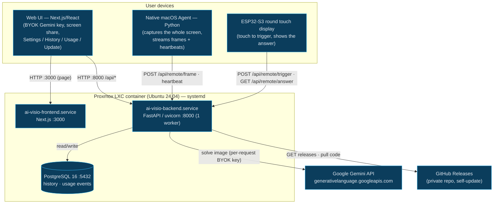
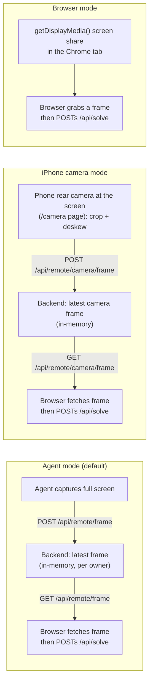
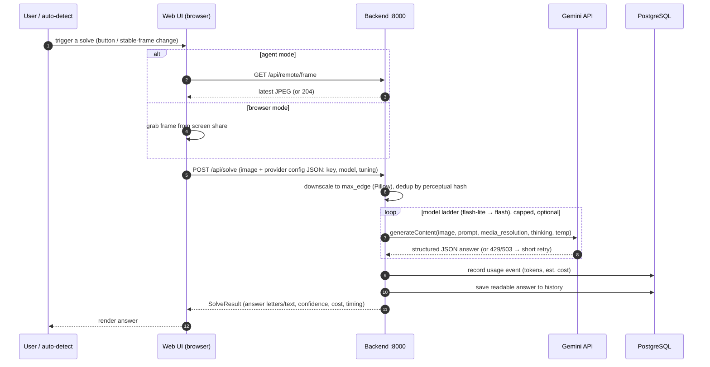
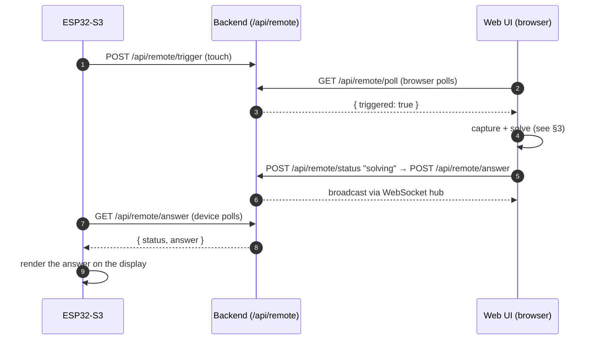
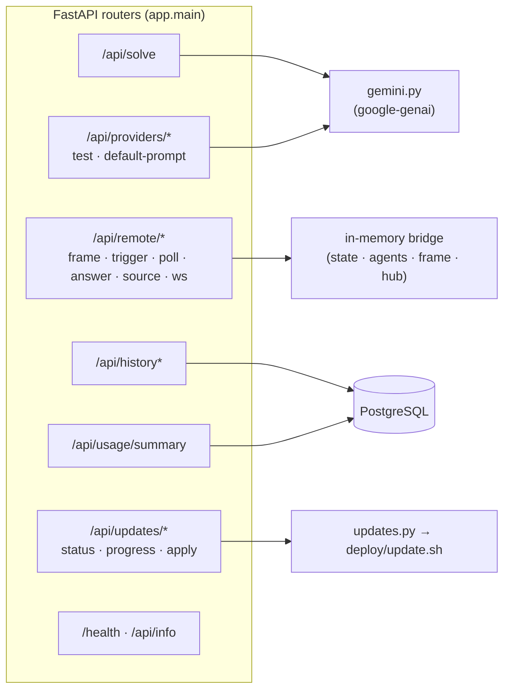
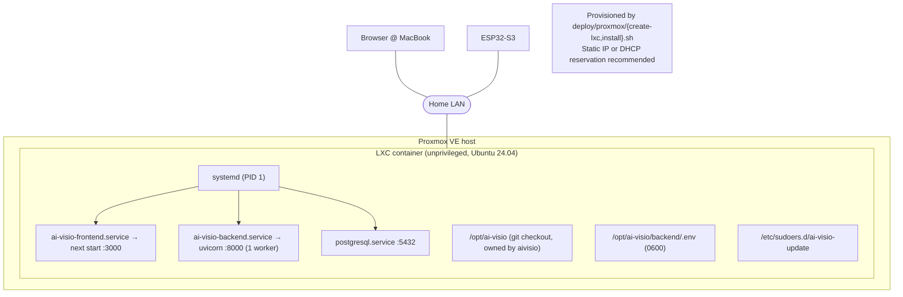
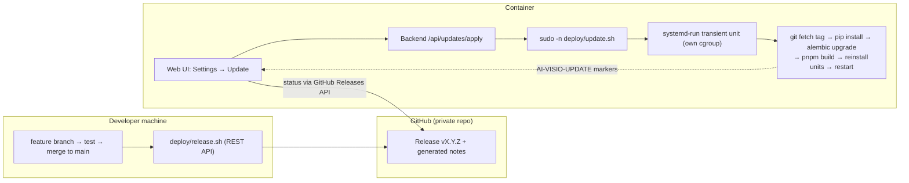

# AI VISIO — Technical Architecture

A screen-aware, multiple-choice exam solver. A screen frame (from the browser's own
screen-share **or** a native macOS agent) is sent to **Google Gemini** (bring-your-own-key),
which returns a structured answer that is shown in the web UI and pushed to an **ESP32-S3
touch display**.

---

## 1. System context & components



| Component | Tech | Responsibility |
|---|---|---|
| **Web UI** | Next.js 16 / React / TS / Tailwind | Holds the Gemini API key (BYOK, `localStorage`), captures/forwards frames, triggers solves, renders answers, Settings (incl. fine-tuning), History, Usage, and in-app Update. |
| **Backend** | FastAPI + uvicorn (Python 3.12), **single worker** | Solve orchestration, Gemini calls, remote-control bridge (ESP32 ⇄ browser), history/usage persistence, self-update. |
| **Native agent** | Python | Streams the whole macOS screen to the backend so solving needs no per-tab browser share; sends heartbeats. |
| **ESP32-S3** | Arduino / LovyanGFX | Physical trigger + answer display over Wi-Fi. |
| **PostgreSQL 16** | — | Solve history and metered usage events (for the cost dashboard). |
| **Google Gemini** | `google-genai` SDK | Vision model that reads the question and returns a structured answer. |

> The backend runs **exactly one uvicorn worker** on purpose: the remote-control bridge
> (trigger state, agent registry, latest frame, WebSocket hub) lives in **per-process
> memory**. Multiple workers would each hold a divergent view and cause flapping.

---

## 2. Capture sources

There are three ways a screen frame reaches the solver. The active source is tracked in the
backend (`/api/remote/source`) and defaults to **agent**.



- The **browser always performs the solve** because it holds the BYOK Gemini key — even
  in agent/camera mode the recording device only pushes frames; it never needs the key.
- `GET /api/remote/frame` and `/api/remote/camera/frame` return **`204 No Content`** when
  no fresh frame exists (not `404`), so ~1 fps preview polling doesn't spam the console.
- The **iPhone camera** page warps the user-selected screen quad back to a flat rectangle
  (perspective/keystone correction, `frontend/lib/warp.ts`) before uploading, so Gemini
  reads a screenshot-like image. iOS requires the page to be served over **HTTPS** for
  `getUserMedia` to grant camera access.

---

## 3. Solve request flow



**Quality/speed knobs** (Settings → Fine-tuning; sent per request in the BYOK config):
`model`, `max_edge` (image size), `media_resolution` (low/medium/high), `temperature`,
`thinking_budget`, `max_output_tokens`, `system_prompt`, `extra_context`, and
`auto_escalate` (retry with a stronger model when a frame is unreadable).

---

## 4. ESP32 trigger ⇄ answer bridge

The screenshot lives in the browser, so the ESP32 can't capture it. The backend is a
small in-memory relay between the device and the browser.



---

## 5. Backend API surface



Secrets & config live in `backend/.env` (mode `0600`, gitignored): `DATABASE_URL`,
`AUTH_SECRET`, `ENCRYPTION_KEY`, `FRONTEND_ORIGINS`, `GITHUB_TOKEN`. The **Gemini key is
never stored server-side** — it travels per solve request from the browser.

---

## 6. Deployment topology



- **Ports:** frontend `:3000`, backend `:8000`, PostgreSQL `:5432` (LAN only).
- **Auto-start:** all three units are `enabled` → they come back after a container reboot;
  set the container's `onboot=1` for host reboots.
- `NEXT_PUBLIC_API_URL` is **baked into the frontend build** → it must match the
  container's IP:8000.

---

## 7. Self-update & release pipeline

GitHub **Actions are disabled org-wide**, so releases are cut from a dev machine via the
GitHub REST API, and the container updates itself to a chosen release tag.



Hard-won details baked into the updater:

- **Single worker** — the in-memory bridge cannot span processes.
- `git config --system safe.directory` — root operating on an `aivisio`-owned checkout.
- **`systemd-run` transient unit** — the updater escapes the backend's cgroup so restarting
  the backend can't kill it mid-run; it always writes a `SUCCESS`/`FAILED` marker.
- **Backend must be able to `sudo`** — `NoNewPrivileges` is intentionally **off** on the
  backend unit (it blocks sudo's setuid); sudo is scoped to exactly `update.sh` via the
  sudoers rule.
- **Stale-timeout** — a `running` log with no writes for >10 min is reported `failed`, so
  the UI never spins forever (covers OOM `SIGKILL`).
- **Launch detection** — the apply endpoint waits briefly and surfaces a denied `sudo`
  instead of silently hanging.

---

## 8. Technology summary

| Layer | Stack |
|---|---|
| Frontend | Next.js 16 (Turbopack), React, TypeScript, Tailwind CSS |
| Backend | Python 3.12, FastAPI, uvicorn, Pydantic v2, SQLAlchemy + Alembic, Pillow, httpx, `google-genai` |
| Data | PostgreSQL 16 |
| Device | ESP32-S3 (Arduino / PlatformIO, LovyanGFX) |
| Agent | Python (screen capture) |
| Infra | Proxmox LXC (Ubuntu 24.04), systemd, bash deploy scripts |
| AI | Google Gemini (`gemini-2.5-flash-lite` default, escalates to `flash`) |
```
